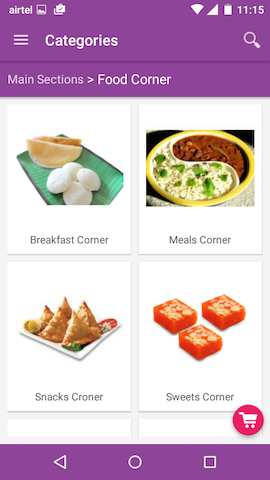
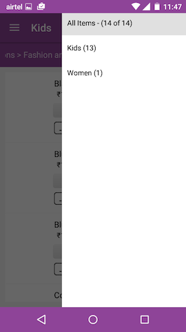
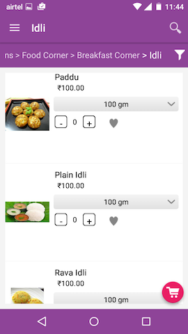
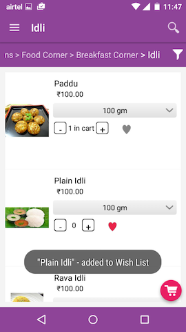
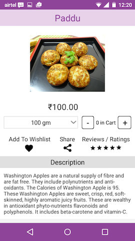
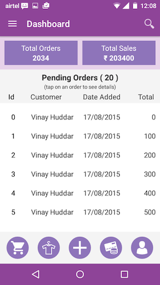
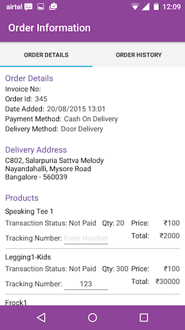

# Nukkad
Android App for enabling eCommerce in closed communities

This repo contains the codebase for the Android App that I created for my company's eCommerce venture, Nukkad. 

Following are some nukkadscreenshots from the Nukkad App.

### Landing Screen

   

### Category Navigation Screens

   

### Navigation Drawer and Product Filter Drawer

   

### Product Listing Screens

      

### Product Detail Screen

### Cart Screen and Delivery / Payment Screen

   

### Seller Dashboard

### Orders Information

   

### Orders Filtering

   

### Search Screens

   
